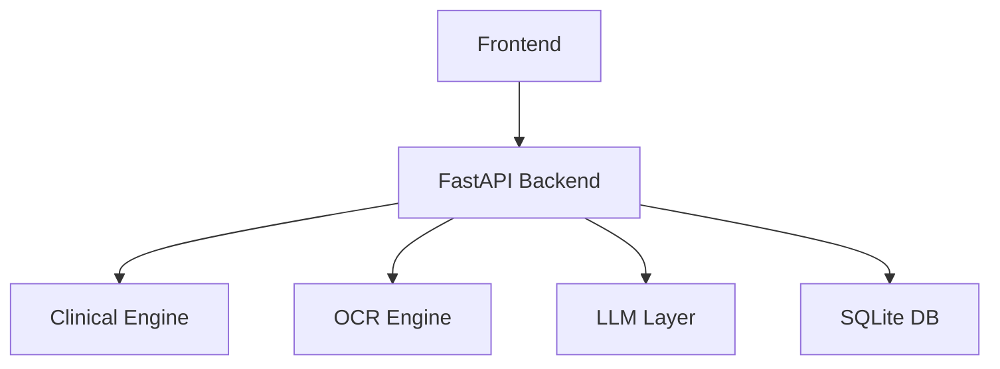

# 🏥 HealthMitra Scan  
### *Healthcare Anywhere, Even Without Internet*

<p align="center">
  
  
  
  
  
  
</p>

---

## 💡 The Problem

Millions of people still struggle with:
- ❌ No access to doctors  
- ❌ Poor understanding of medical reports  
- ❌ No internet for digital health tools  

Healthcare shouldn’t depend on connectivity.

---

## 🚀 The Solution

**HealthMitra Scan** is a **fully offline healthcare assistant** that:

- 📄 Explains medical reports  
- ❤️ Predicts disease risks  
- 💬 Answers medical questions  
- 🧑‍⚕️ Helps healthcare workers manage patients  

👉 All running locally. No internet required.

---

## ✨ Features

### 📄 Report Explainer
<p align="center">
  
</p>

- Upload PDF/image  
- OCR + medical value extraction  
- Guideline-based classification (ADA, ACC/AHA, WHO)  
- Simple English explanations  

---

### ❤️ Risk Predictor
<p align="center">
  
</p>

- Predicts:
  - Diabetes risk  
  - Heart disease risk  
- Detects critical conditions early  

---

### 💬 Offline Medical Chatbot
<p align="center">
  
</p>

- Local LLM (Ollama)  
- Medical knowledge base (RAG)  
- Works without internet  

---

### 🏥 Rural ASHA Mode
<p align="center">
  
</p>

- Multi-patient management  
- Village clustering  
- Risk prioritization  
- Visit scheduling  

**Default ASHA login:** `asha@healthmitra.local` / `Asha@123` (see `asha_credentials.txt`)

---

## 🔥 Why This Matters

- 🌍 Works in **low-connectivity areas**
- 🔒 Keeps **all data private**
- 🧠 Combines **clinical rules + optional local LLM**
- ⚡ Enables **early detection & intervention**

---

## 🧠 Tech Stack

### Frontend
- React 18 + Vite

### Backend
- FastAPI + SQLAlchemy + SQLite

### LLM (optional)
- Ollama (Phi-3 / Llama 3)

### Data Processing
- Tesseract OCR
- pdfplumber
- ChromaDB (RAG)

---

## 🧱 Architecture



---

## ⚡ Quick Start

```bat
git clone https://github.com/your-username/healthmitra-scan.git
cd healthmitra-scan
setup.bat
run.bat
```

## 🌐 Run Locally

| Service  | URL |
|----------|-----|
| Frontend | http://localhost:5173 |
| Backend  | http://localhost:8000 |
| API Docs | http://localhost:8000/docs |

**Default user login:** `user@gmail.com` / `12345` (see `user_credentials.txt`)

---

## 📸 Screenshots

<p align="center">
  
  
</p>

---

## 🏆 Impact

HealthMitra is designed for:

- 🏥 Rural clinics
- 👩‍⚕️ ASHA workers
- 📄 Patients with no medical knowledge
- 🌐 Areas with limited internet

---

## 🚧 Roadmap

- Mobile app
- Voice-based assistant
- More languages
- Edge optimization

---

## 👨‍💻 Team

Team: Core 4 Codeers

---

## ⭐ Support

If you like this project:

- ⭐ Star the repo
- 🔗 Share it
- 🚀 Build on it
