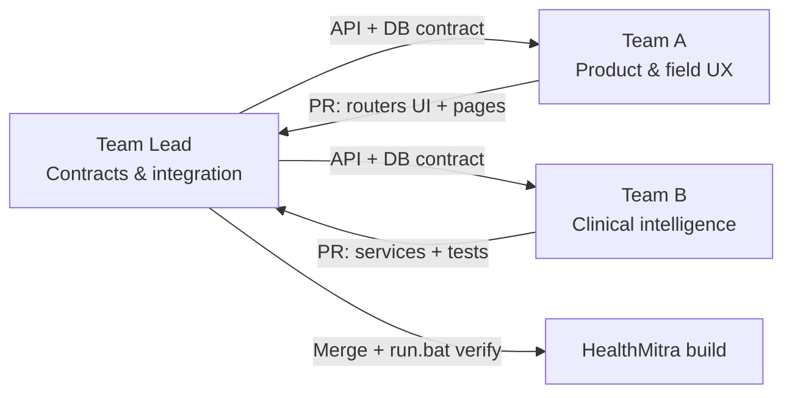

# HealthMitra Scan — Work Distribution (Domain-Based)

This document describes how **Team A**, **Team B**, and the **Team Lead** divide work by **functional domain**, not by file ownership. Deliverables flow into a single integrated product; the Team Lead reviews and merges everything into one working build (`setup.bat` → `run.bat`).

Only features that exist in the codebase **and are wired into the running app** are listed below.

---

## What Is Actually Built and Working

| Domain | Feature | Who uses it | Backend | Frontend |
|--------|---------|-------------|---------|----------|
| Identity | User signup & login (JWT) | Patient | `/api/auth/register`, `/login` | `Signup.jsx`, `Login.jsx` |
| Identity | ASHA coordinator login | ASHA | `/api/auth/asha-login` | `Login.jsx` (ASHA mode) |
| Identity | Profile + photo + village | Patient | `/api/auth/me`, `/profile`, `/upload-photo` | `Profile.jsx` |
| Identity | Family link by email | Patient | `/api/family/*` | `Profile.jsx` |
| Clinical | Medical report upload & scan | Patient | `/api/reports/upload` | `ReportExplainer.jsx` |
| Clinical | Risk predictor (vitals → diabetes/heart %) | Patient | `/api/risk/predict` | `RiskPredictor.jsx` |
| Clinical | Health Twin (vitals, reports, at-risk labels) | Patient | `/api/health_twin/` | `HealthTwin.jsx` |
| Clinical | User dashboard & activity | Patient | `/api/dashboard/*` | `Dashboard.jsx` |
| Visits | Schedule visit | Patient | `/api/visits/` POST | `VisitPlanner.jsx` |
| Visits | Check-in with admin code | Patient | `/api/visits/{id}/check-in` | `VisitPlanner.jsx` |
| Visits | Visit history | Patient | `/api/visits/` GET | `VisitsHistory.jsx` |
| Field ops | OurHealth Mode (synced patients) | ASHA | `/api/ourhealth/dashboard` | `RuralMode.jsx` |
| Field ops | Patient registry & cluster map | ASHA | `/api/ourhealth/patients`, layout in UI | `RuralMode.jsx` |
| Field ops | Visit planner & outreach (phones) | ASHA | `/api/ourhealth/visits` | `RuralMode.jsx` |
| Admin | Patient database & severity | Admin | `/api/admin/patients` | `AdminPatients.jsx` |
| Admin | Scheduled visits + check-in codes | Admin | `/api/admin/visits` | `AdminAppointments.jsx` |
| Admin | Village statistics | Admin | `/api/admin/villages` | `AdminVillages.jsx` |
| Content | Respiratory FAQs (static, bilingual) | Patient | — (client-only) | `RespiratoryFaqs.jsx` |
| Data | SQLite users, patients, reports, visits, family links | All | `models.py`, `init_db`, migrations | — |
| Data | Sample users (~20, password `Sample@123`) | Dev/demo | `services/sample_seed.py` | — |
| Ops | One-time setup & run | Dev | `setup.bat`, `run.bat` | Vite proxy to API |

**Not in the live app (do not assign as current work):** offline medical chatbot UI, Health Memory page, ChromaDB chat RAG surface, mobile app.

---

## Integrated Delivery Workflow



1. **Contract (Team Lead)** — Agree on request/response shapes (`schemas.py`), tables (`models.py`), and which API paths the UI will call.
2. **Build (parallel)** — Team A improves screens and routers; Team B improves clinical engines that those routes call.
3. **Handoff** — Each team submits a short note: what changed, how to test, sample credentials if needed.
4. **Integration (Team Lead)** — Pull both branches, resolve conflicts, run `setup.bat` and `run.bat`, smoke-test patient + ASHA + admin flows.
5. **Release** — Single `healthmitra_v2.db` behavior and one frontend build.

---

## Domain Ownership

### Team A — Product Experience, APIs & Field Operations UI

**Mission:** Expose clinical logic through clear APIs and role-based interfaces (patient, ASHA, admin).

| Work package | Includes (conceptually) | Feeds into |
|--------------|-------------------------|------------|
| Patient app shell | Auth context, routing, theme, navigation | All patient routes |
| Report & risk UI | Upload flow, results display, local health cache per user | Report Scanner, Risk Predictor |
| Health Twin & dashboard | Fetch and display integrated profile | Dashboard, Health Twin |
| Visits | Create visits, code check-in modal | Visit Planner, History |
| Profile & family | Edit profile, link/unlink family by email | Profile, OurHealth household view |
| OurHealth Mode | Sync button, patients grid, cluster map, visits, outreach | ASHA login → `RuralMode.jsx` |
| Admin portal | Patients, appointments (codes), villages | Admin role routes |
| HTTP layer | FastAPI routers matching UI needs; auth guards | `backend/routers/*` |

**Does not own:** Core OCR parsing rules, clinical guideline tables, raw risk formulas.

**Typical handoff to Team Lead:** Router + JSX changes + manual test steps (e.g. “login as ASHA, click Sync, open Cluster Map”).

---

### Team B — Clinical Intelligence & Health Data Processing

**Mission:** Turn raw medical inputs into structured, explainable, storable health outputs.

| Work package | Includes (conceptually) | Feeds into |
|--------------|-------------------------|------------|
| Report pipeline | OCR, clinical parsing, risk score on upload, EN/HI explanations | Report Scanner, Health Twin, Admin severity |
| Risk engine | Diabetes/heart scoring from vitals, recommendations, emergency checks | Risk Predictor, Health Twin, timeline |
| Vitals & timeline | Persist risk runs per user; height/weight on profile path | Health Twin, OurHealth severity |
| Alerts & thresholds | At-risk classification rules (e.g. glucose, BP, BMI) | Health Twin UI labels |
| Report storage | `MedicalReport` + `HealthTimeline` consistency with `user_id` / `patient_id` | Dashboard, OurHealth patient cards |

**Does not own:** React pages, visit booking UI, cluster map layout, admin chrome.

**Typical handoff to Team Lead:** Updated `backend/services/*` (e.g. `ocr_service`, `clinical_engine`, `risk_engine`, `llm_service`, `alert_service`) + a short test command or script proving upload/risk still works.

---

### Team Lead — Architecture, Integration & Quality

**Mission:** Keep one coherent system; Team A and Team B stay aligned.

| Responsibility | Examples |
|----------------|----------|
| Data model | `User`, `Patient`, `Visit`, `FamilyLink`, migrations in `database.py` |
| Cross-role sync | `patient_sync` on register/profile; OurHealth dashboard aggregation |
| App assembly | `main.py` router registration, CORS, static uploads |
| Tooling | `setup.bat` (deps, Tesseract winget command, build), `run.bat` |
| Demo data | When to run `sample_seed`, `sample_users_credentials.txt` |
| Integration QA | Patient signup → scan → risk → twin; ASHA sees patient; admin sees visit code |
| Scope control | Reject features not in the table above until contracted |

**Does not own:** Day-to-day UI polish inside Team A’s pages or regex/guideline tweaks inside Team B’s engines (except review).

---

## Suggested Parallel Backlog (Optional)

| Priority | Team A | Team B | Team Lead |
|----------|--------|--------|-----------|
| P0 | Fix UX bugs on Profile, Visit Planner | Improve OCR accuracy / PDF text paths | Merge + verify `run.bat` |
| P1 | OurHealth filters & empty states | Tune at-risk thresholds with clinical input | Document API contract changes |
| P1 | Admin patient detail modal | Faster report pipeline errors | Seed script refresh policy |
| P2 | Hindi copy pass on FAQs | Optional Ollama path for explanations (if configured) | Release checklist |

---

## Handoff Checklist (Teams → Team Lead)

Before requesting integration, each team confirms:

- [ ] Changes match the domain table (no silent schema changes without Lead approval)
- [ ] `python -c "import main"` succeeds from `backend/` (Team B backend changes)
- [ ] `npm run build` succeeds in `frontend/` (Team A)
- [ ] Listed test accounts and steps (patient / `asha@healthmitra.local` / admin if applicable)
- [ ] No secrets committed (use env / local credential files only)

---

## LLM Role Prompts (Local Assistant)

Copy the block for your role into a local LLM when you need deep, project-specific help.

---

### Team A — Product & Field Operations (copy from here)

```text
You are Team A for HealthMitra Scan: Product Experience, APIs & Field Operations UI.

PROJECT: FastAPI backend + React (Vite) frontend. You own routers and UI that patients, ASHA workers, and admins touch. You call Team B's services; you do not reimplement OCR or risk math in JSX.

ROLES & ROUTES:
- Patient (role user): Dashboard, Report Scanner, Risk Predictor, Health Twin, FAQs, Visit Planner, Visits History, Profile (+ family link by email)
- ASHA (role asha_coordinator): OurHealth Mode only — RuralMode.jsx synced via GET /api/ourhealth/dashboard
- Admin (role admin): /admin — patients, appointments with check-in codes, village stats

YOUR LIVE API SURFACES:
- /api/auth/* (register, login, asha-login, me, profile, photo)
- /api/reports/*, /api/risk/predict, /api/health_twin/, /api/dashboard/*
- /api/visits/* (user-scoped list, create, check-in code)
- /api/family/* (link by email: spouse/parent/child/sibling only)
- /api/ourhealth/* (ASHA dashboard, add patient, schedule visit)
- /api/admin/* (patients, visits, villages)

KEY UI: frontend/src/pages/*.jsx, App.jsx routing, AuthContext.jsx, utils/healthSync.js (per-user localStorage key hm_health_sync_{userId}).

RULES:
- Do not add chatbot or Health Memory routes unless Team Lead adds them to the contract.
- Family relation dropdown: no generic "family" option — only spouse, parent, child, sibling.
- Visits are per user_id; OurHealth shows all patients from DB sync, not hardcoded demo lists.
- Use Authorization: Bearer token from AuthContext for protected calls.

WHEN STUCK: Specify role (patient/ASHA/admin), page URL, and network tab status code.

DELIVERABLE FORMAT: Screens affected, API paths used, manual test script (login → action → expected result).
```

---

### Team B — Clinical Intelligence (copy from here)

```text
You are Team B for HealthMitra Scan: Clinical Intelligence & Health Data Processing.

PROJECT: Offline-first rural health app (FastAPI + SQLite + React). You own algorithms and services, NOT React UI or visit booking screens.

YOUR LIVE FEATURES (only discuss/improve these):
- Medical report upload: OCR (Tesseract), clinical_engine parsing, llm_service explanations (EN/HI), risk_score on MedicalReport
- Risk predictor: risk_engine + alert_service; POST /api/risk/predict saves HealthTimeline vitals JSON per user
- Health Twin inputs: merge reports + timeline vitals; at-risk rules for metrics (glucose, BP, cholesterol, BMI)
- Data written to: medical_reports, health_timeline; linked via user_id and patient_id

KEY MODULES: backend/services/ocr_service.py, clinical_engine.py, risk_engine.py, llm_service.py, alert_service.py; backend/routers/reports.py, risk.py, health_twin.py (coordinate with Lead before large router changes).

RULES:
- Do not build chatbot UI, ChromaDB user chat, or Health Memory (not shipped).
- Keep functions testable without the frontend; prefer unit-style scripts in repo root only if Lead approves.
- Respect schemas from backend/schemas.py and models from backend/models.py — propose schema changes to Team Lead, do not silently alter DB.
- Report upload uses get_optional_user; always set user_id + patient_id via patient_sync pattern.

WHEN STUCK: Ask for sample PDF/image path, expected marker output, and whether Gemini or Ollama is configured in backend/config.py.

DELIVERABLE FORMAT: What changed, how to test (curl or python one-liner), risks/regressions for Report Scanner and Risk Predictor.
```

---

### Team Lead — Integration & Architecture (copy from here)

```text
You are the Team Lead for HealthMitra Scan: Architecture, Integration & Quality.

You integrate Team A (routers + React) and Team B (clinical services). You own the single source of truth for data shape and release readiness.

YOU OWN:
- backend/models.py, database.py (init_db, migrations, sample_seed trigger)
- backend/schemas.py, services/patient_sync.py, main.py router list
- setup.bat, run.bat, sample_users_credentials.txt
- Merge conflicts between services and routers; ensure patient rows exist on user register
- End-to-end flows: new user → profile village → visit → ASHA sees patient on Sync → admin sees appointment code

INTEGRATION MAP:
- Register/login → User + Patient (patient_sync) → visible in /api/ourhealth/dashboard
- Report upload → MedicalReport + timeline → Health Twin + admin severity
- Risk predict → timeline vitals → Health Twin height/weight/risk
- Family link → family_links table → OurHealth household + Profile list

TEAM HANDOFFS:
- Team A delivers: UI/router changes + role-based test steps
- Team B delivers: service-layer changes + test evidence for report/risk pipeline
- You: run setup.bat if needed, run.bat, smoke all three roles; reject scope creep (chatbot, Health Memory) unless scheduled

DEMO ACCOUNTS: sample01@healthmitra.demo … balli@healthmitra.demo, password Sample@123; ASHA from asha_credentials.txt; admin user must exist in DB with role admin.

DELIVERABLE: Integrated branch, short release notes, known limitations (e.g. Tesseract required for image OCR, Gemini key for LLM explanations if configured).
```

---

## Quick Reference — Test Logins

| Role | How to log in |
|------|----------------|
| Patient | Sign up, or `sample01@healthmitra.demo` / `Sample@123` (see `sample_users_credentials.txt`) |
| ASHA | Login → ASHA mode → credentials in `asha_credentials.txt` |
| Admin | User with `role=admin` in database (create via DB or seed policy from Lead) |

---

*Last aligned to app routes in `frontend/src/App.jsx` and routers registered in `backend/main.py`.*
